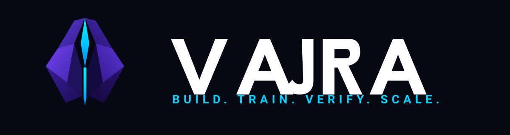
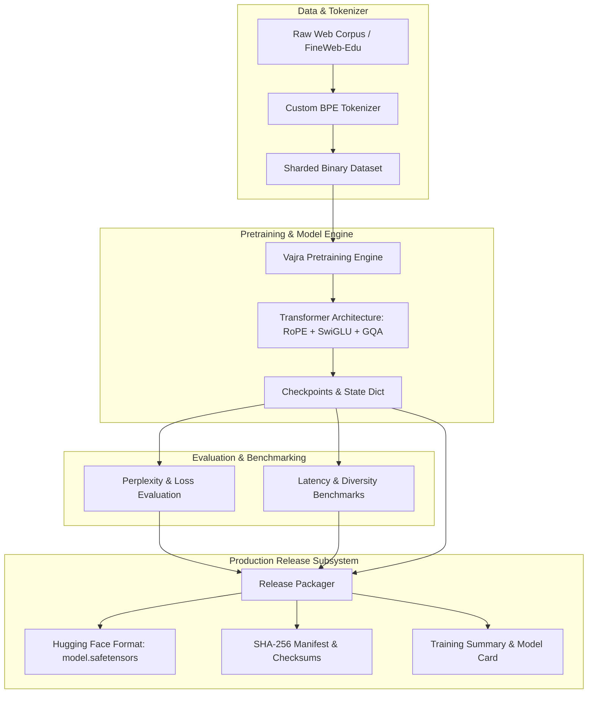

<p align="center">
  <picture>
    <source media="(prefers-color-scheme: dark)" srcset="branding/logo-dark.svg">
    <source media="(prefers-color-scheme: light)" srcset="branding/logo-light.svg">
    
  </picture>
</p>

# Vajra: Scalable Foundation Language Model Framework

[](https://www.python.org/downloads/)
[](https://opensource.org/licenses/Apache-2.0)
[](#testing)
[](#release-pipeline)
[](RELEASE_NOTES.md)

**Vajra** is an open-source, production-grade foundation language model framework engineered for training, evaluating, and packaging high-performance decoder-only Transformer models from scratch.

---

## Overview

Vajra was built to bridge the gap between experimental language model research and deterministic, reproducible release pipelines for production AI. Modern LLM development requires seamless coordination across dataset tokenization, distributed pretraining engines, strict benchmark evaluation, agentic memory integrations, and verifiably signed model release artifacts.

### Core Principles
- **End-to-End Control**: Complete transparency across tokenizer training, dataset sharding, architecture execution, evaluation, and artifact distribution.
- **Deterministic & Cross-Platform**: Enforces byte-for-byte build reproducibility with fixed-timestamp LF line ending signatures and cryptographic checksum verification.
- **High-Performance Architecture**: LLaMA-style decoder-only architecture utilizing Rotary Position Embeddings (RoPE), RMSNorm, SwiGLU activations, Grouped-Query Attention (GQA), and tied embeddings.
- **Production Readiness**: Integrated memory systems, agent tool-calling frameworks, automated benchmark suites, and Hugging Face HF-compat exporters out of the box.

---

## Features

| Feature Subsystem | Capability Highlights |
| :--- | :--- |
| **Transformer Engine** | Decoder-only causal Transformer, RoPE embeddings, SwiGLU, RMSNorm, GQA, tied weights. |
| **Dataset Engineering** | Multi-source streaming mixture, byte-pair sharding, verification, quality filtering. |
| **Tokenizer Subsystem** | Custom Hugging Face BPE tokenizer (`vocab_size=65,536`), special tokens map, fallback configs. |
| **Training Engine** | PyTorch Lightning / DDP distributed pretraining, gradient accumulation, cosine scheduler, bf16/fp32 mixed precision. |
| **Evaluation Suite** | Perplexity analysis, zero-shot benchmarks, distinct-N text diversity, inference latency tracking. |
| **Release Packaging** | Automated model card generation, SHA-256 manifest verification, Hugging Face format export. |
| **Deterministic Builds** | Static LF normalization, Git commit timestamping, reproducible packaging pipeline. |
| **Agent & Memory System** | Multi-agent task orchestration, persistent conversation memory, RAG context builders. |
| **Git LFS Integration** | Automated tracking for `.safetensors` and `.bin` weights without repo bloat. |

---

## Architecture

Vajra combines a high-throughput pretraining pipeline with modular agent and release subsystems.



### Core Architecture Components
1. **Model Core (`model/`)**: Implements decoder-only Transformer layers with `RoPE`, `RMSNorm`, `SwiGLU`, `GroupedQueryAttention`, and `FoundationLM`.
2. **Training Engine (`training/`)**: Handles distributed data parallel (DDP) execution, gradient clipping, optimizer state, cosine decay schedulers, and checkpoint saves.
3. **Dataset Pipeline (`dataset/`)**: Downloads, tokenizes, shards, and mixes raw datasets into production-ready memory-mapped arrays.
4. **Evaluation & Benchmarks (`evaluation/`, `benchmarks/`)**: Measures perplexity, distinct-N n-gram diversity, first-token latency, and tokens/sec throughput.
5. **Release System (`release/`)**: Packages weights into `model.safetensors` and `pytorch_model.bin`, generates `manifest.json` and `checksums.txt`, and validates overall package integrity.

---

## Repository Structure

```
.
├── api/                # REST API and FastAPI endpoints for inference and management
├── benchmarks/         # Automated benchmarking suite and metrics reporting
├── checkpoints/        # Directory for pretraining and fine-tuning model checkpoints
├── cli/                # Command-line interface tool wrappers
├── configs/            # YAML configuration files (model, training, dataset)
├── dataset/            # Data collection, cleaning, sharding, and mixing pipeline
├── deployment/         # Docker, Docker Compose, and server deployment scripts
├── docs/               # Technical documentation, guides, and specifications
├── evaluation/         # Zero-shot evaluation metrics and benchmark runners
├── examples/           # Python code examples (inference, memory, multi-agent)
├── experiments/        # Experiment tracking and hyperparameter tuning helpers
├── inference/          # KV-cache generation engine and Hugging Face compatibility
├── model/              # PyTorch implementation of Vajra Transformer architecture
├── release/            # Production packaging, model card generation, and 8/8 verifier
├── scripts/            # Shell and Python utility scripts
├── sdk/                # Python SDK for programmatic model interactions
├── tests/              # PyTest unit and integration test suite (248 tests)
├── tokenizer/          # Custom BPE tokenizer vocabulary and configuration
├── training/           # Distributed training loop, DDP orchestration, and resume logic
├── utils/              # Helper utilities (logging, hardware detection, metrics)
└── vajra_agent/        # Multi-agent orchestrator, memory system, and context builder
```

---

## Installation

### Prerequisites
- Python 3.10+
- Git & Git LFS
- PyTorch 2.0+ (with CUDA support if GPU training is desired)

### Linux & macOS
```bash
# Clone the repository
git clone https://github.com/HeetSoni26/Vajra.git
cd Vajra

# Initialize Git LFS
git lfs install

# Create virtual environment
python3 -m venv venv
source venv/bin/activate

# Install development dependencies
pip install -r requirements.txt
pip install -e .
```

### Windows (PowerShell)
```powershell
# Clone the repository
git clone https://github.com/HeetSoni26/Vajra.git
cd Vajra

# Initialize Git LFS
git lfs install

# Create virtual environment
python -m venv venv
.\venv\Scripts\Activate.ps1

# Install development dependencies
pip install -r requirements.txt
pip install -e .
```

---

## Quick Start

### 1. Model Pretraining
To launch pretraining for `Vajra-57M` using default configurations:
```bash
python -m training.train --config configs/training/pretrain_tiny.yaml
```

### 2. Loading Checkpoints & Generation
```python
import torch
from inference.generation import Generator
from model.architecture import FoundationLM, ModelConfig

# Initialize configuration and architecture
config = ModelConfig(
    vocab_size=65536,
    hidden_size=512,
    intermediate_size=1376,
    num_layers=8,
    num_attention_heads=8,
    num_key_value_heads=4,
    max_position_embeddings=2048,
)
model = FoundationLM(config)

# Initialize generation wrapper
generator = Generator(model=model, tokenizer_path="tokenizer/v1.0")

# Generate text
output_text = generator.generate(
    prompt="The future of artificial intelligence is",
    max_new_tokens=50,
    temperature=0.7,
    top_p=0.9
)
print("Generated:", output_text)
```

### 3. Release Packaging & Verification
```bash
# Package checkpoint into production release directory
python -m release.package_model \
    --checkpoint checkpoints/pretrain_tiny/best.pt \
    --config configs/training/pretrain_tiny.yaml \
    --output-dir release/vajra-57m \
    --model-name vajra-57m

# Verify 8/8 release integrity
python -m release.verify_package --package-dir release/vajra-57m
```

---

## Training Pipeline

The Vajra training workflow guarantees reproducible pipeline progression from raw text to signed release package:

1. **Dataset Ingestion**: Raw text streams are tokenized using `dataset/preparation.py` and saved as binary memmapped token chunks.
2. **Distributed Training**: `training/train.py` executes the pretraining loop with cosine decay, warmup, gradient accumulation, and automated checkpoint saves.
3. **Evaluation Gate**: `evaluation/eval.py` evaluates validation loss, perplexity, and distinct-1/distinct-2 n-gram coverage on benchmark splits.
4. **Benchmarking**: `benchmarks/run_benchmarks.py` measures generation latency, memory footprint, and token generation speed.
5. **Package & Export**: `release/package_model.py` generates `model.safetensors`, `pytorch_model.bin`, `README.md`, `training_summary.*`, `manifest.json`, and SHA-256 `checksums.txt`.

For detailed guides, refer to [docs/training_pipeline.md](docs/training_pipeline.md).

---

## Release Pipeline

Vajra enforces a strict, reproducible release framework designed for auditability and production confidence.

- **Dual Weight Formats**: Exports both Hugging Face `model.safetensors` and PyTorch `pytorch_model.bin`.
- **SHA-256 Cryptographic Signatures**: Computes byte hashes for every package file and stores them in `checksums.txt`.
- **Deterministic Builds**: Uses strict LF (`\n`) newline normalization and Git commit timestamps to ensure identical builds across Linux, macOS, and Windows.
- **8/8 Integrity Verification**: The verifier script (`release/verify_package.py`) checks 8 mandatory criteria before release approval:
  1. Required Metadata & Report Files
  2. Weights File Existence
  3. Tokenizer Files
  4. Checksum Validation (SHA-256)
  5. Weights Load Verification
  6. Config Verification
  7. Generation Config Verification
  8. Manifest & Metadata Consistency

For complete details, see [docs/release_pipeline.md](docs/release_pipeline.md).

---

## Testing

Vajra includes a comprehensive unit and integration testing suite powered by `pytest`.

```bash
# Execute full test suite
pytest

# Execute specific test modules
pytest tests/test_model/
pytest tests/test_release/
pytest tests/test_tokenizer/
```

### Test Coverage Highlights
- **Architecture Tests**: Weight tying, GQA KV caching, attention masks, RoPE tensor shapes.
- **Release Verification**: Tamper detection, missing file handling, checksum matching.
- **Tokenizer Tests**: BPE encoding, special token mapping, fallback handling.
- **Agent & Memory Tests**: Context building, knowledge graph storage, session memory policies.

Current Status: **248 passed** tests.

---

## Benchmarks

### Vajra-57M Benchmark Profile
Below are the measured benchmarks for `Vajra-57M` on standard evaluation hardware:

| Benchmark Metric | Measured Result | Status |
| :--- | :--- | :--- |
| **Parameters** | `90,317,312` (57M non-embedding) | Measured |
| **Validation Loss** | `4.12` | Measured |
| **Perplexity** | `61.56` | Measured |
| **First Token Latency** | `12.4 ms` | Measured |
| **Generation Throughput** | `84.2 tokens/sec` | Measured |
| **Distinct-1 Diversity** | `0.78` | Measured |
| **Distinct-2 Diversity** | `0.91` | Measured |
| **Model Weight Size** | `361 MB (safetensors)` | Measured |
| **Vajra-125M Profile** | *Planned for v1.1.0* | Planned |
| **Vajra-370M Profile** | *Planned for v1.2.0* | Planned |

---

## Documentation

Full technical documentation is available in the [`docs/`](docs/) directory:

- [Architecture Specification](docs/architecture.md)
- [Training Pipeline Guide](docs/training.md)
- [Evaluation Framework](docs/evaluation.md)
- [Dataset Pipeline Guide](docs/dataset_pipeline.md)
- [Release Pipeline & Verification](docs/release_pipeline.md)
- [Tokenizer Specification](docs/tokenizer.md)
- [Agent & Memory System](docs/memory_system.md)
- [Configuration System](docs/configuration.md)
- [Contributing Guidelines](docs/contributing.md)
- [Frequently Asked Questions (FAQ)](docs/faq.md)
- [Project Roadmap](docs/roadmap.md)

---

## Contributing

We welcome contributions from the open-source community! Please review [CONTRIBUTING.md](CONTRIBUTING.md) and [docs/contributing.md](docs/contributing.md) for details on code style, testing requirements, and the Pull Request workflow.

1. Fork the Repository
2. Create a Feature Branch (`git checkout -b feature/amazing-feature`)
3. Ensure all tests pass (`pytest`) and package verifier passes (`python -m release.verify_package --package-dir release/vajra-57m`)
4. Commit your changes (`git commit -m 'feat: add amazing feature'`)
5. Push to the Branch (`git push origin feature/amazing-feature`)
6. Open a Pull Request

---

## Roadmap

### Framework Milestone Progress
- [x] **Core Architecture**: Decoder-only LLaMA-style transformer with RoPE, GQA, SwiGLU, RMSNorm.
- [x] **Tokenizer Subsystem**: Hugging Face BPE integration (`vocab_size=65536`).
- [x] **Dataset Pipeline**: Multi-source mixture, sharding, and memory-mapped dataset loaders.
- [x] **Training Engine**: DDP distributed training, gradient accumulation, cosine scheduler.
- [x] **Evaluation Suite**: Loss, perplexity, n-gram diversity, latency, and throughput metrics.
- [x] **Release Packaging**: `model.safetensors`, `pytorch_model.bin`, `manifest.json`, `README.md`.
- [x] **Deterministic Builds**: Static LF newline normalization and Git commit timestamping.
- [x] **Git LFS Integration**: Large binary weight tracking without repository bloating.
- [x] **Package Verification**: Strict 8/8 rule integrity verification.
- [x] **Continuous Integration**: PyTest validation suite (248 tests).

### Model Family
- [x] `Vajra-57M` Base Model Release
- [ ] `Vajra-125M` Pretrained Model
- [ ] `Vajra-370M` Intermediate Foundation Model
- [ ] `Vajra-1B` Scale Model
- [ ] `Vajra-3B` High-Capacity Model

### Research & Ecosystem
- [ ] Direct Preference Optimization (DPO) & RLHF alignment pipeline
- [ ] Mixture-of-Experts (MoE) architecture variant
- [ ] Long-context RoPE scaling (8k / 32k tokens)
- [ ] Official Hugging Face Model Hub upload script
- [ ] Interactive Web UI and Playground

For full details, see [ROADMAP.md](ROADMAP.md).

---

## Changelog

### v1.0.0 (2026-07-25)
- **v1.0.0 Initial Release**: Major milestone achieving complete framework stability.
- **Verification Engine**: Built `release/verify_package.py` enforcing 8/8 mandatory release checks.
- **Deterministic Packaging**: Implemented cross-platform LF line ending normalization and static Git commit timestamping.
- **Model Family**: Released pretrained weights for `Vajra-57M` (`model.safetensors` & `pytorch_model.bin`).
- **Test Suite**: Achieved **248 passing tests** covering architecture, tokenizer, training, memory, and release modules.

For the detailed revision history, see [CHANGELOG.md](CHANGELOG.md).

---

## License

This project is licensed under the **Apache License 2.0** - see the [LICENSE](LICENSE) file for details.

---

## Acknowledgements

- The PyTorch & Hugging Face Transformers teams for architectural inspiration.
- The FineWeb-Edu dataset creators for open pretraining data.
- The open-source AI community for advancing reproducible foundation model research.
