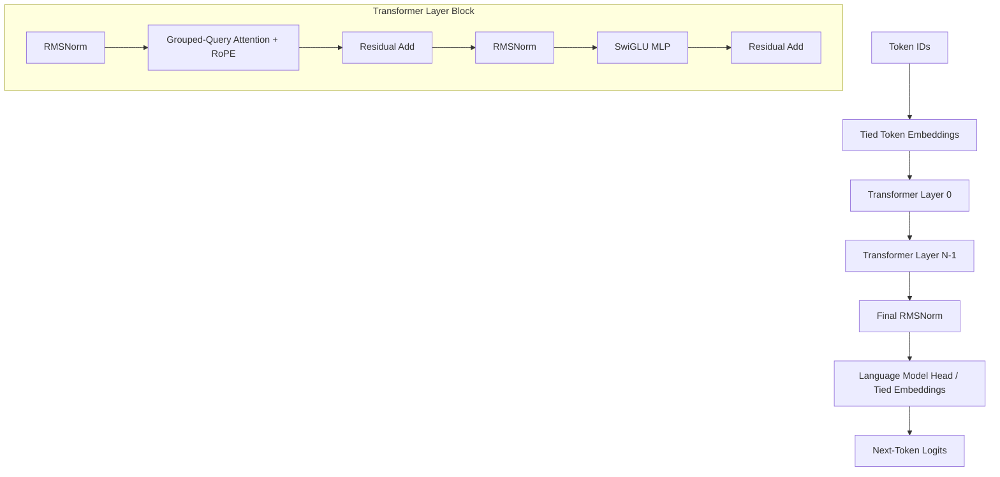

# Vajra Architecture Specification

[Overview](../README.md) | [Training](training.md) | [Evaluation](evaluation.md) | [Release Pipeline](release_pipeline.md)

---

## Architectural Overview

Vajra implements an optimized, decoder-only causal Transformer architecture based on the LLaMA lineage. It is engineered for maximum throughput during pretraining and low-latency autoregressive token generation during inference.



---

## Key Design Specifications

### 1. Rotary Position Embeddings (RoPE)
Instead of absolute position embeddings or relative bias matrices, Vajra utilizes Rotary Position Embeddings (RoPE) applied to Query and Key representations at every attention layer. This enables:
- Superior position-relative attention mechanics without extra parameter footprint.
- Natural extrapolation capabilities for context windows up to `2048` tokens (expandable via linear/dynamic scaling).

### 2. RMSNorm (Root Mean Square Normalization)
Pre-normalization is applied using `RMSNorm` prior to both self-attention and feed-forward blocks:
$$\text{RMSNorm}(x) = \frac{x}{\sqrt{\frac{1}{d}\sum_{i=1}^d x_i^2 + \epsilon}} \odot \gamma$$
- Replaces standard LayerNorm to eliminate mean-centering computational overhead.
- Configurable numerical stability epsilon ($\epsilon = 10^{-6}$).

### 3. SwiGLU Activation Function
The Feed-Forward Network (FFN) utilizes Swish-Gated Linear Units (SwiGLU) instead of standard GELU or ReLU:
$$\text{FFN}_{\text{SwiGLU}}(x) = \left( \text{Swish}(x W_g) \odot x W_u \right) W_d$$
- Hidden dimension scaling ratio is set to $d_{ff} = \frac{8}{3} d_{model}$ (rounded to nearest multiple of 128/256), yielding enhanced model capacity per parameter count.

### 4. Grouped-Query Attention (GQA)
To reduce KV-cache memory pressure during multi-token autoregressive decoding, Vajra supports Grouped-Query Attention (GQA):
- Allows $N_q$ Query heads to share $N_{kv}$ Key/Value heads ($N_{kv} \le N_q$).
- Drastically improves inference throughput on GPU memory-constrained setups.

### 5. Tied Word Embeddings
To maximize parameter efficiency in sub-1B models like `Vajra-57M`, the input token embedding matrix and the output language modeling head share identical weight tensors ($W_{embed} \equiv W_{head}$).

---

## Model Specifications Table

| Model Variant | Parameters | $d_{model}$ | Layers | Query Heads | KV Heads | $d_{ff}$ | Context Window |
| :--- | :--- | :--- | :--- | :--- | :--- | :--- | :--- |
| **Vajra-57M** | `90,317,312` | 512 | 8 | 8 | 4 | 1376 | 2048 |
| **Vajra-125M** | `125,000,000` | 768 | 12 | 12 | 4 | 2048 | 2048 |
| **Vajra-370M** | `370,000,000` | 1024 | 24 | 16 | 4 | 2816 | 2048 |

---

## Python Architecture Code Reference

The primary implementation resides in [`model/architecture.py`](../model/architecture.py).

```python
from model.architecture import FoundationLM, ModelConfig

# Initialize configuration
config = ModelConfig(
    vocab_size=65536,
    hidden_size=512,
    intermediate_size=1376,
    num_layers=8,
    num_attention_heads=8,
    num_key_value_heads=4,
    max_position_embeddings=2048,
    tie_word_embeddings=True,
)

# Instantiate PyTorch Module
model = FoundationLM(config)
print(f"Model Parameters: {sum(p.numel() for p in model.parameters()):,}")
```
