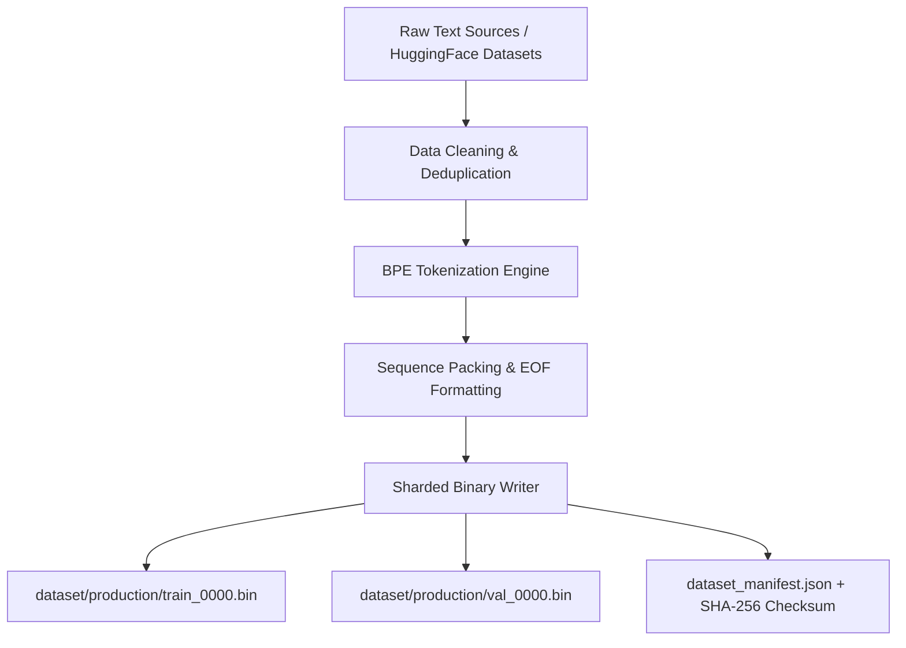

# Vajra Dataset Pipeline Guide

[Overview](../README.md) | [Tokenizer](tokenizer.md) | [Training](training.md) | [Configuration](configuration.md)

---

## Overview

The Vajra dataset engineering pipeline converts raw, heterogeneous text corpora (e.g. FineWeb-Edu, Wikipedia, OpenWebText, GitHub code) into high-performance, tokenized, sharded, binary memory-mapped files (`.bin` / `.npy`) optimized for zero-copy DDP pretraining.

---

## Dataset Pipeline Architecture



---

## Pipeline Components

### 1. Data Downloading & Storage (`dataset/downloaders.py`)
Downloads multi-source web corpora using streaming interfaces to avoid local memory exhaustion.

### 2. Tokenization & Sequence Packing (`dataset/preparation.py`)
- Tokenizes raw strings into integer token arrays using the `VajraTokenizer`.
- Packs sequences into uniform length chunks (`context_length = 2048`) separated by `<|endoftext|>` BOS/EOS tokens (`id = 1` / `id = 2`).
- Eliminates padding overhead during pretraining via greedy sequence concatenation.

### 3. Binary Sharding & Cataloging (`dataset/sharding.py`, `dataset/catalog.py`)
- Converts token lists into `uint16` or `uint32` binary arrays (depending on `vocab_size`).
- Writes sharded chunks (e.g. 100M tokens per file shard).
- Generates `dataset_manifest.json` containing metadata, token counts, split boundaries, and cryptographic SHA-256 signatures.

---

## Running Dataset Preparation

To prepare a production dataset mixture:

```bash
python -m dataset.preparation \
    --config configs/dataset/dataset_production.yaml \
    --output-dir dataset/production \
    --tokenizer-dir tokenizer/v1.0
```

To validate dataset shards before pretraining:

```bash
python -m dataset.validation --data-dir dataset/production
```

---

## Dataset Configuration Example (`configs/dataset/dataset_production.yaml`)

```yaml
dataset_name: "FineWeb-Edu Production Mixture"
vocab_size: 65536
sequence_length: 2048
shard_size_tokens: 100000000
dtype: "uint16"

mixtures:
  - name: "fineweb_edu"
    weight: 0.80
    split: "train"
  - name: "wikipedia_en"
    weight: 0.10
    split: "train"
  - name: "github_code"
    weight: 0.10
    split: "train"

validation_ratio: 0.01
seed: 42
```
