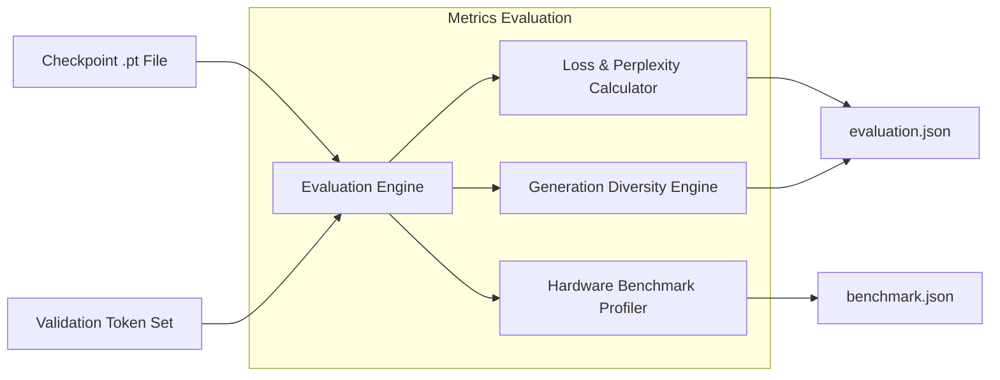

# Vajra Evaluation Framework

[Overview](../README.md) | [Architecture](architecture.md) | [Training](training.md) | [Benchmarks](benchmarking_framework.md)

---

## Overview

The Vajra evaluation pipeline quantifies language model performance across two primary dimensions:
1. **Statistical Quality & Language Modeling**: Validation Loss, Perplexity, Distinct-1 / Distinct-2 n-gram token diversity, and Repetition Rate.
2. **Inference Performance & Telemetry**: First-Token Latency (ms), Tokens/Second Generation Throughput, and Memory Consumption (MB).

---

## Evaluation Architecture



---

## Core Metrics Defined

### 1. Perplexity (PPL)
Perplexity evaluates the predictive quality of the language model over validation text tokens:
$$\text{PPL} = \exp\left( \frac{1}{N} \sum_{i=1}^N -\log P(w_i \mid w_1, \dots, w_{i-1}) \right)$$
Lower perplexity scores indicate better language understanding and modeling capacity.

### 2. N-Gram Diversity (Distinct-1 & Distinct-2)
Measures the ratio of unique unigrams (Distinct-1) and bigrams (Distinct-2) relative to total generated tokens:
$$\text{Distinct-N} = \frac{|\text{Unique } N\text{-grams}|}{|\text{Total } N\text{-grams}|}$$
Higher distinct scores (closer to `1.0`) indicate diverse generation without repetitive degeneration.

### 3. First Token Latency (TTFT)
Time-to-First-Token measures the millisecond latency required for the model to perform initial prompt encoding and generate token `1`.

### 4. Generation Throughput
Measures ongoing autoregressive decoding speed in `tokens/second` utilizing KV-caching.

---

## Executing Evaluations

To run evaluation on a trained checkpoint:

```bash
python -m evaluation.eval \
    --checkpoint checkpoints/pretrain_tiny/best.pt \
    --config configs/training/pretrain_tiny.yaml \
    --output evaluations/checkpoint_250/metrics.json
```

To run generation latency & throughput benchmarks:

```bash
python -m benchmarks.run_benchmarks \
    --checkpoint checkpoints/pretrain_tiny/best.pt \
    --config configs/training/pretrain_tiny.yaml \
    --output benchmarks/reports/checkpoint_250/benchmark.json
```

---

## Output Metrics Format (`evaluation.json`)

```json
{
  "checkpoint_step": 250,
  "validation_loss": 4.12,
  "perplexity": 61.56,
  "dataset_name": "FineWeb-Edu Validation Split",
  "evaluation_timestamp": "2026-07-25T01:00:00Z"
}
```
