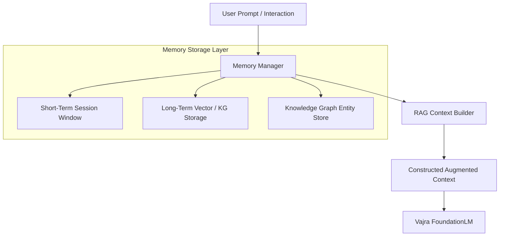

# Vajra Agent & Memory System

[Overview](../README.md) | [Architecture](architecture.md) | [Configuration](configuration.md)

---

## Overview

The `vajra_agent/` module provides a stateful agentic layer and structured memory system designed for long-running interaction sessions, context retrieval, tool integration, and knowledge graph storage.

---

## Memory System Architecture



---

## Memory Components

1. **Memory Manager (`vajra_agent/memory_manager.py`)**: Coordinates short-term message buffers and long-term retrieval queries.
2. **Context Builder (`vajra_agent/context_builder.py`)**: Assembles prompts with retrieved memory snippets under context length budgets.
3. **Knowledge Graph (`vajra_agent/knowledge_graph.py`)**: Extracts and stores entity-relation triplets (`subject - relation - object`) for factual recall across multi-turn chats.
4. **Retention Policies (`vajra_agent/policies.py`)**: Implements decay policies, sliding windows, and importance scoring to purge stale context.

---

## Code Example: Conversation Memory Session

```python
from vajra_agent.memory_manager import MemoryManager
from vajra_agent.context_builder import ContextBuilder

# Initialize memory manager
memory = MemoryManager(storage_path="logs/memory_store.db")

# Store turn interaction
session_id = "user_session_101"
memory.add_interaction(session_id, user_msg="What is the capital of France?", assistant_msg="The capital of France is Paris.")

# Build context for new prompt
builder = ContextBuilder(memory_manager=memory)
context = builder.build_context(session_id=session_id, query="What did we discuss about France?")
print("Augmented Context:\n", context)
```
