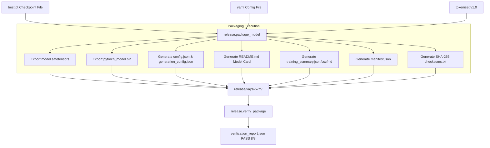

# Vajra Release Pipeline & Verification System

[Overview](../README.md) | [Architecture](architecture.md) | [Training](training.md) | [Evaluation](evaluation.md)

---

## Overview

The Vajra Release Subsystem (`release/`) transforms pretraining checkpoints into production-ready, signed release packages compatible with Hugging Face ecosystem tools, PyTorch, and standalone inference deployments.

---

## Release Pipeline Architecture



---

## Release Package Layout (`release/vajra-57m/`)

A finalized release package contains the following structure:

```
release/vajra-57m/
├── README.md                  # Hugging Face Model Card with YAML frontmatter
├── LICENSE                    # Software & weights license file
├── config.json                # Hugging Face compatible model configuration
├── generation_config.json     # Default generation hyperparameters
├── metadata.json              # Git commit provenance & training metadata
├── manifest.json              # Detailed file manifest & metadata record
├── checksums.txt              # SHA-256 hashes of all package artifacts
├── model.safetensors          # Hugging Face SafeTensors weight binary
├── pytorch_model.bin          # PyTorch state dict weight binary
├── tokenizer.json             # Fast BPE Tokenizer definition
├── tokenizer_config.json      # Tokenizer configuration mapping
├── special_tokens_map.json    # Special token mapping
├── evaluation.json            # Quality evaluation results
├── benchmark.json             # Latency & throughput telemetry
├── training_summary.csv       # Tabular summary of pretraining run
├── training_summary.json      # Machine-readable summary of pretraining run
├── training_summary.md        # Executive markdown training report
└── verification_report.json   # 8/8 verification result output
```

---

## Deterministic Build Principles

To achieve cross-platform byte-level determinism:
1. **Line Ending Normalization**: All generated text files (JSON, CSV, Markdown, text) are written with strict `\n` (LF) line terminators using explicit `newline="\n"` parameters.
2. **Deterministic Timestamps**: The packager reads the Git commit timestamp of `HEAD` (`get_git_timestamp()`), preventing dynamic wall-clock variations across builds.
3. **Sorted JSON Keys**: All JSON serializations use `sort_keys=True` and `indent=2`.

---

## 8/8 Verification Criteria

The verifier (`release/verify_package.py`) enforces 8 mandatory checks:

| Check # | Name | Verification Rule |
| :--- | :--- | :--- |
| **1** | **Required Metadata & Report Files** | Confirms `config.json`, `generation_config.json`, `metadata.json`, `manifest.json`, `evaluation.json`, `benchmark.json`, `README.md`, `training_summary.*`, and `checksums.txt` exist. |
| **2** | **Weights File Existence** | Confirms `model.safetensors` or `pytorch_model.bin` exists. |
| **3** | **Tokenizer Files** | Confirms `tokenizer.json` or `tokenizer_config.json` exists. |
| **4** | **Checksum Validation (SHA-256)** | Computes SHA-256 for every file and asserts match with `checksums.txt`. |
| **5** | **Weights Load Verification** | Deserializes tensors via `safetensors` or `torch.load` to verify structural integrity. |
| **6** | **Config Verification** | Validates `config.json` JSON schema and required architectural keys. |
| **7** | **Generation Config Verification** | Validates `generation_config.json` formatting and generation parameters. |
| **8** | **Manifest & Metadata Consistency** | Asserts parameter counts, model names, git hashes, and steps match between `manifest.json` and `metadata.json`. |

---

## Executing Package Generation & Verification

```bash
# 1. Package a model checkpoint
python -m release.package_model \
    --checkpoint checkpoints/pretrain_tiny/best.pt \
    --config configs/training/pretrain_tiny.yaml \
    --output-dir release/vajra-57m \
    --model-name vajra-57m

# 2. Run verification
python -m release.verify_package --package-dir release/vajra-57m
```
