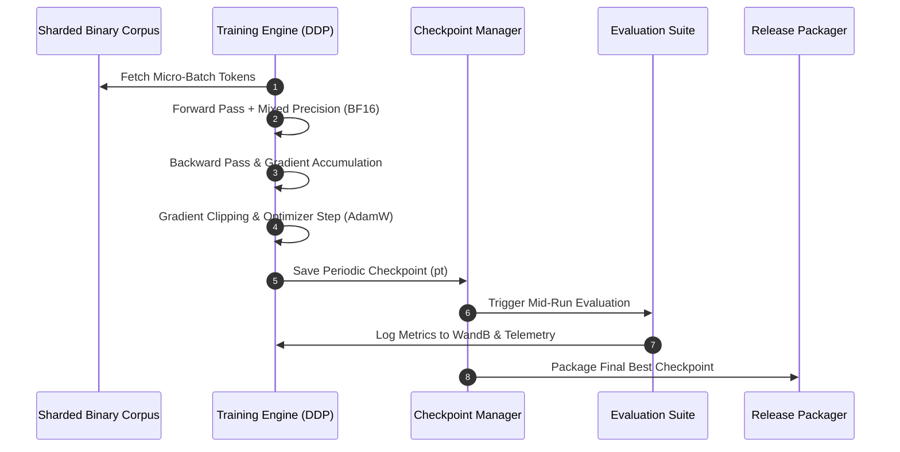

# Vajra Training Pipeline Guide

[Overview](../README.md) | [Architecture](architecture.md) | [Dataset Pipeline](dataset_pipeline.md) | [Evaluation](evaluation.md)

---

## Overview

The Vajra training subsystem provides a scalable, distributed pretraining environment built on PyTorch DDP (Distributed Data Parallel) and PyTorch Lightning integration. It features automated gradient accumulation, mixed precision (bf16/fp32), cosine learning rate scheduling with linear warmup, and crash-resilient checkpoint management.

---

## Training Lifecycle



---

## Configuration File Structure

Training runs are configured via YAML files in [`configs/training/`](../configs/training/). Below is an example for `pretrain_tiny.yaml`:

```yaml
# Model Configuration Reference
model_config: "configs/model/model_tiny.yaml"
data_dir: "dataset/production"
output_dir: "checkpoints/pretrain_tiny"
tokenizer_path: "tokenizer/v1.0"

# Hyperparameters
sequence_length: 2048
global_batch_tokens: 524288
micro_batch_size: 1
gradient_accumulation_steps: 64
learning_rate: 0.0003
min_learning_rate: 0.00003
warmup_steps: 100
weight_decay: 0.1
adam_beta1: 0.9
adam_beta2: 0.95
adam_epsilon: 1e-8
grad_clip: 1.0

# Execution Rules
max_steps: 2000
max_tokens: 1000000000
save_every_steps: 200
eval_every_steps: 100
precision: "bf16"
scheduler: "cosine"
wandb_project: "vajra-lm-tiny"
```

---

## Executing Training

### Single GPU Pretraining
```bash
python -m training.train --config configs/training/pretrain_tiny.yaml
```

### Multi-GPU Distributed Training (DDP)
```bash
python -m training.distributed_train \
    --config configs/training/pretrain_tiny.yaml \
    --gpus 4
```

### Resuming from Checkpoints
To resume pretraining automatically from the latest saved step:
```bash
python -m training.train \
    --config configs/training/pretrain_tiny.yaml \
    --resume
```

---

## Optimizer & Learning Rate Schedule

Vajra uses **AdamW** with decoupled weight decay combined with a **Cosine Annealing Scheduler** with linear warmup:

1. **Linear Warmup Phase**: Learning rate linearly increases from `0` to $\eta_{max}$ across `warmup_steps` (e.g., 100 steps).
2. **Cosine Decay Phase**: Learning rate decays according to cosine curve down to $\eta_{min}$:
$$\eta_t = \eta_{min} + \frac{1}{2}(\eta_{max} - \eta_{min})\left(1 + \cos\left(\frac{t - t_{warmup}}{T_{max} - t_{warmup}} \pi\right)\right)$$
3. **Weight Decay**: Applied strictly to non-bias and non-LayerNorm/RMSNorm parameter weights ($0.1$ default).

---

## Monitoring Telemetry

Training progress logs metrics continuously:
- **Global Tokens Processed**: Cumulative count of tokens trained across all GPUs.
- **Micro/Global Loss**: Per-step training cross-entropy loss.
- **Learning Rate**: Current step learning rate.
- **Gradient Norm**: Pre-clipping global gradient norm.
- **GPU Throughput**: Tokens per second per GPU.
